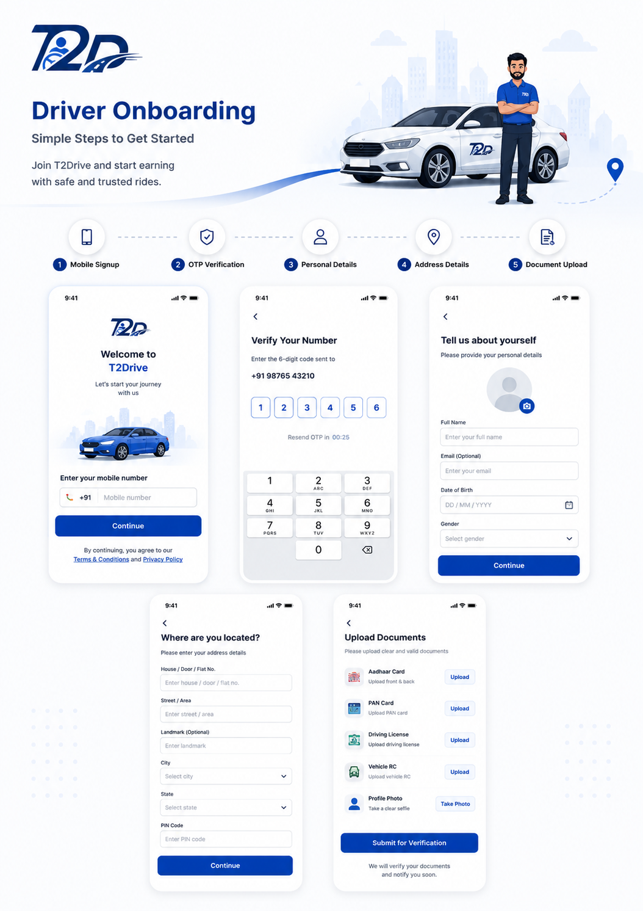
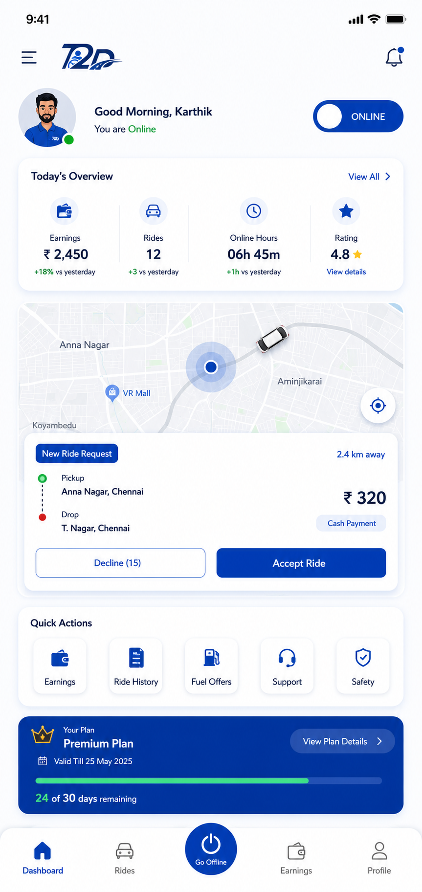
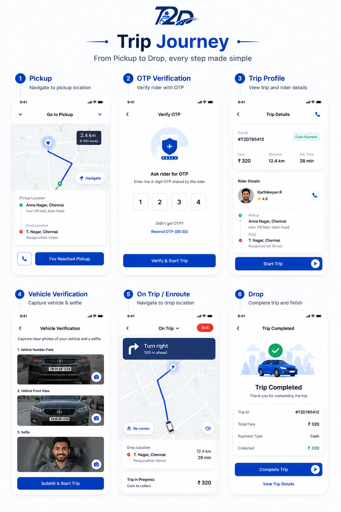
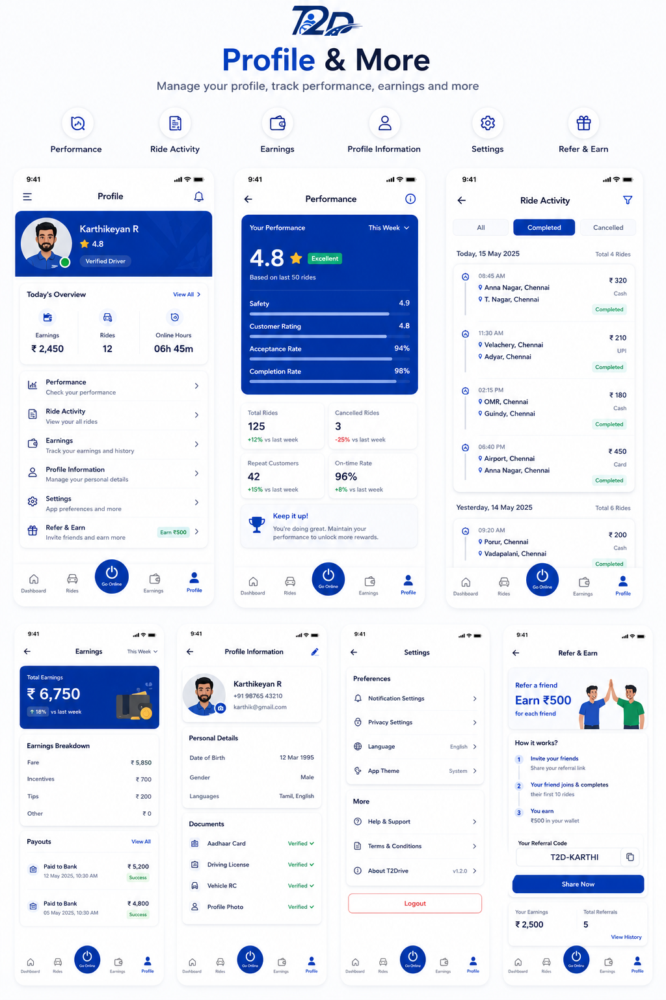
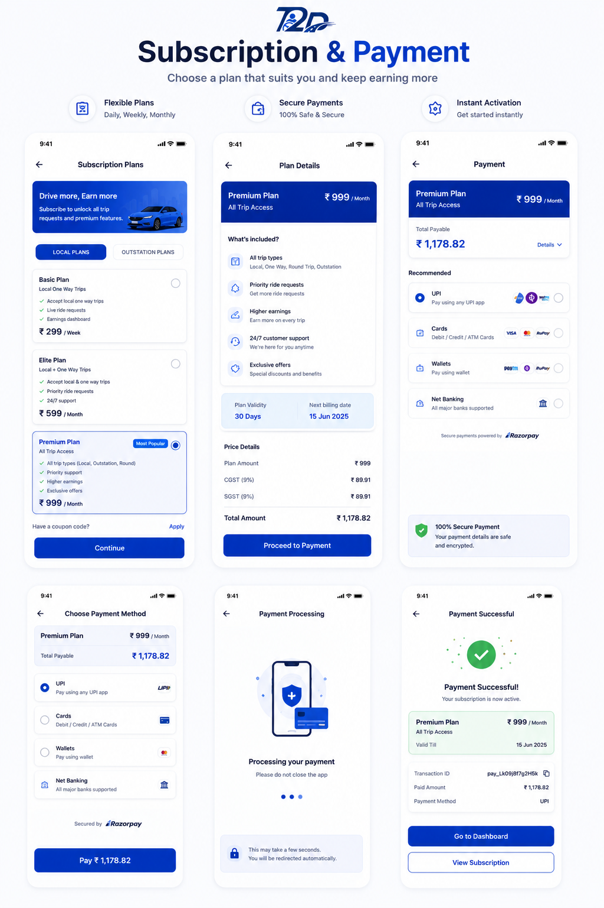

  

  

 

A scalable **Driver Partner Platform** that streamlines **driver onboarding, ride requests, navigation, live tracking, payment collection, and trip management** through a modern, real-time mobile experience.

 

---
## 📖 Project Overview

T2Drive is a comprehensive React Native-based mobility platform designed for driver partners. It streamlines the entire driver journey—from registration and document verification to ride management, navigation, earnings tracking, and secure payment processing. The application provides a seamless, reliable, and user-friendly experience while enabling drivers to efficiently manage daily operations.

---

<h1 align="left">🌟 Core Modules</h1>

<table align="center" width="95%">
<tr>

<td width="33%" valign="top">

<h3>👤 Driver Onboarding</h3>

• 📱 OTP Authentication 
• 👤 Profile Registration 
• 📄 Document Upload 
• 🪪 Aadhaar & PAN Verification 
• 🚘 Driving License 
• 🚗 Vehicle Documents 
• 📷 Profile Photo

</td>

<td width="33%" valign="top">

<h3>🚖 Ride Management</h3>

• ⚡ Live Ride Requests 
• ✅ Accept / Reject Trips 
• 🚕 Local Trips 
• 🛣️ Outstation Trips 
• 🔄 Round Trips 
• 📅 Scheduled Rides 
• ⏳ Waiting & Day Halt

</td>

<td width="33%" valign="top">

<h3>🗺️ Navigation</h3>

• 📍 Google Maps 
• 🧭 Turn-by-Turn Navigation 
• 🚩 Pickup Navigation 
• 🎯 Destination Navigation 
• 📡 Live Tracking 
• 📤 Live Location Sharing 
• ⏱️ ETA Updates

</td>

</tr>

<tr>

<td valign="top">

<h3>💰 Earnings & Payments</h3>

• 💵 Daily Earnings 
• 📊 Ride Statistics 
• 👛 Driver Wallet 
• 💳 Fare Collection 
• ⚡ Razorpay Payments 
• 💎 Subscription Plans 
• 📜 Trip History

</td>

<td valign="top">

<h3>🔔 Real-Time Services</h3>

• 🔄 Socket.IO 
• 📲 Push Notifications 
• 📡 Live Trip Updates 
• 🟢 Online / Offline 
• 🚨 Emergency SOS 
• 📢 Driver Alerts 
• 📍 Driver Status

</td>

<td valign="top">

<h3>⚙️ Performance</h3>

• 🔋 Battery Optimization 
• 📍 Background Tracking 
• ⚡ Fast Performance 
• 🎨 Modern UI/UX 
• 📱 Responsive Design 
• 🔒 Secure Experience 
• 🚀 Optimized Performance

</td>

</tr>
</table>

# 📱 Application Screens

Explore the key modules of the <strong>VDrive Driver Partner App</strong>. Each module showcases a complete workflow with dedicated UI screens and interactions.

<table>
<tr>

<td width="50%" align="center">

## 👤 Driver Onboarding

Digital onboarding experience including OTP verification, personal details, address information, document upload, KYC verification, and approval workflow.

 

<a href="./docs/onboarding.md">
<b>📂 View Complete Gallery →</b>
</a>

</td>

<td width="50%" align="center">

## 🏠 Dashboard

Driver dashboard featuring live maps, online/offline status, earnings summary, ride requests, and real-time performance insights.

 

<a href="./docs/dashboard.md">
<b>📂 View Complete Gallery →</b>
</a>

</td>

</tr>

<tr>

<td width="50%" align="center">

## 🚖 Ride Management

Complete ride lifecycle including request acceptance, navigation, pickup, OTP verification, trip progress, waiting, destination, and payment collection.

 

<a href="./docs/rides.md">
<b>📂 View Complete Gallery →</b>
</a>

</td>

<td width="50%" align="center">

## 👤 Driver Profile

Manage profile information, performance analytics, earnings, ride activity, referral program, settings, and account management.

 

<a href="./docs/profile.md">
<b>📂 View Complete Gallery →</b>
</a>

</td>

</tr>

<tr>

<td colspan="2" align="center">

## 💳 Subscription & Payments

Subscription plans, Razorpay payment integration, wallet management, recharge history, and secure payment collection.

 

<a href="./docs/payments.md">
<b>📂 View Complete Gallery →</b>
</a>

</td>

</tr>

</table>

---

### 📂 Explore Complete Screen Galleries

| 👤 Onboarding | 🏠 Dashboard | 🚖 Ride Flow | 👤 Profile | 💳 Payments |
|:------------:|:------------:|:------------:|:----------:|:-----------:|
| **40+ Screens** | **15+ Screens** | **30+ Screens** | **20+ Screens** | **10+ Screens** |

## ✨ Features

---
## 🛠 Tech Stack

| Mobile | Backend | Database | Cloud |
|---------|----------|----------|--------|
| React Native | Node.js | MongoDB | Firebase |
| TypeScript | Express | PostgreSQL | AWS S3 |
| Redux Toolkit | Socket.IO | Redis | FCM |

---
## 🔌 Integrations

## 📊 Project Status

🟢 *Production Ready*

