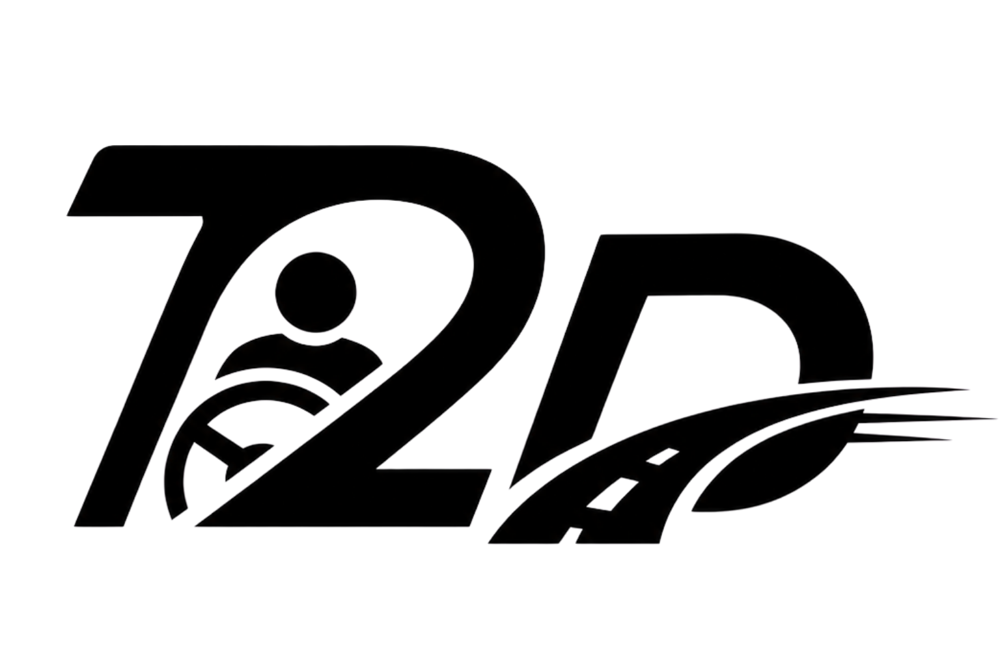
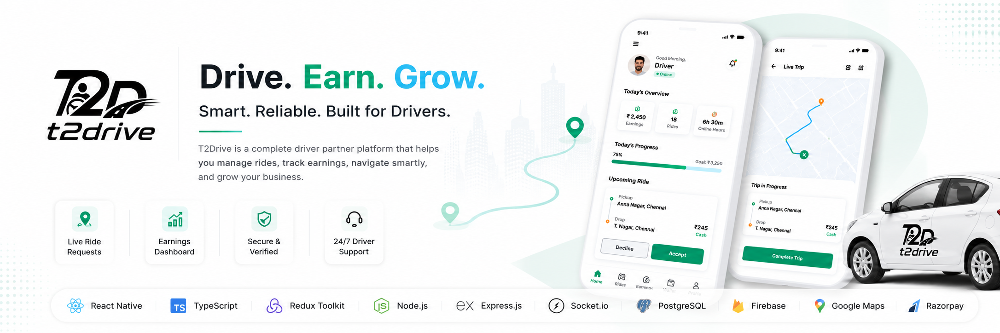

<h1>
  
</h1>

<h3>Driver Partner Platform</h3>

  

  

 

A scalable **Driver Partner Platform** that streamlines **driver onboarding, ride requests, navigation, live tracking, payment collection, and trip management** through a modern, real-time mobile experience.

 

---
